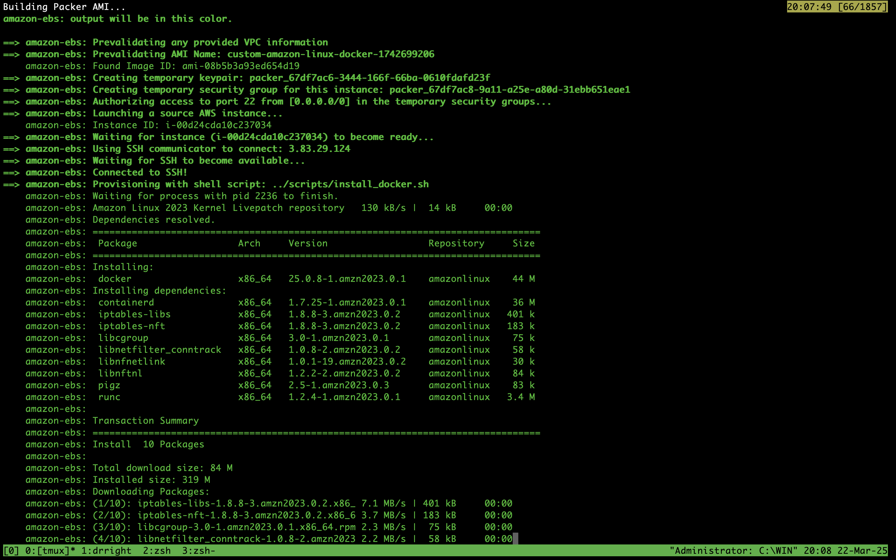
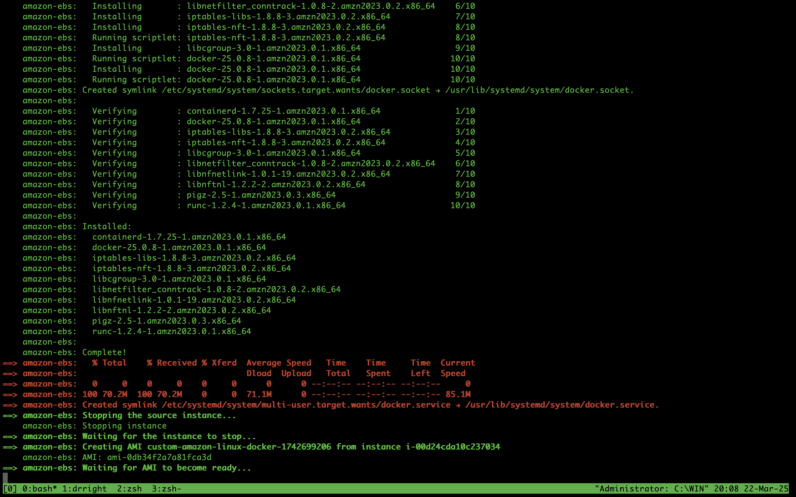
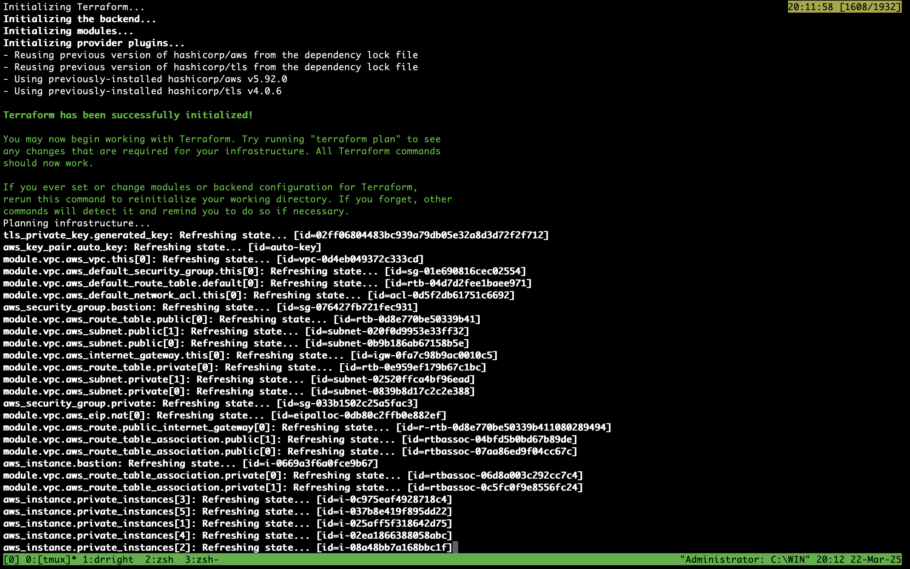
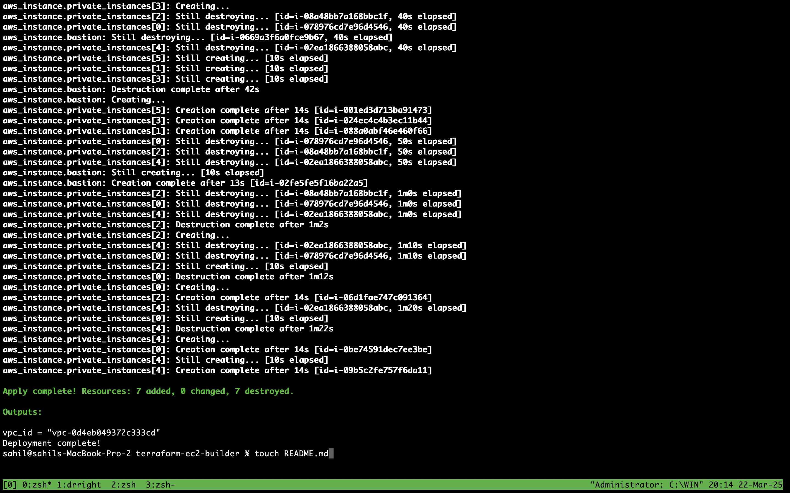
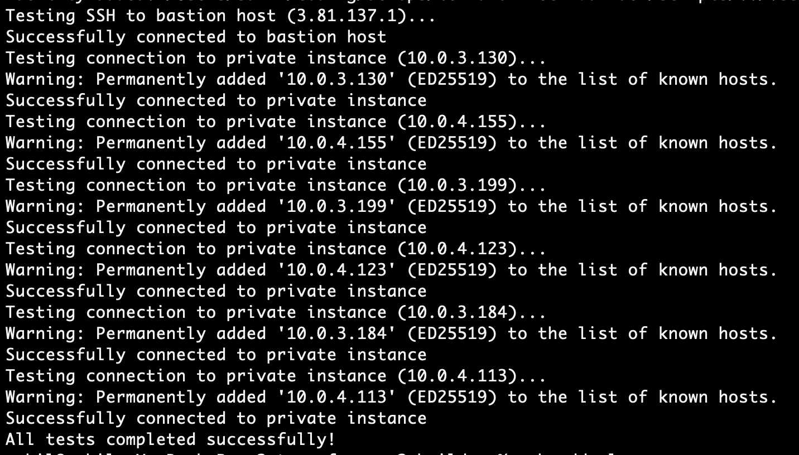
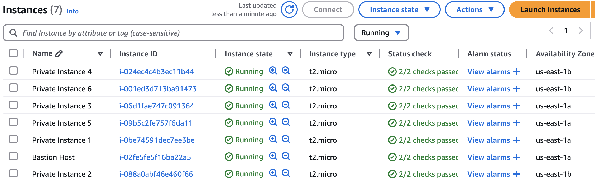
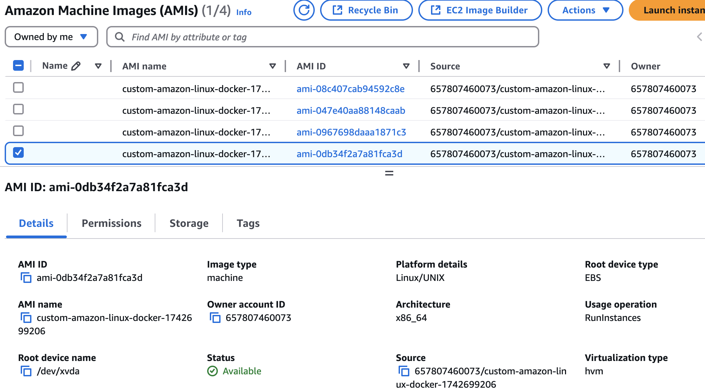

# AWS Infrastructure with Custom AMI and Terraform Provisioning

This repository contains the infrastructure-as-code for creating a custom AWS environment using a custom Amazon Machine Image (AMI) built with Packer and provisioning the necessary AWS resources with Terraform.

## Overview

This project automates the following:

1. **Custom AWS AMI Creation using Packer**  
   - **Base OS:** Amazon Linux  
   - **Installed Software:** Docker  
   - **SSH Configuration:** Your SSH public key is automatically added to allow login using your private key

2. **AWS Infrastructure Provisioning using Terraform**  
   The Terraform scripts in this repo provision the following resources:
   - A new VPC with both public and private subnets
   - All necessary routing (Internet gateway, NAT gateway, route tables)
   - One bastion host in the public subnet that only accepts SSH connections (port 22) from your IP address
   - Six EC2 instances in the private subnet, all launched using the custom AMI created via Packer

## Repository Structure

```
.
├── packer/                  
│   ├── amazon-linux.json    # Packer template for custom AMI
├── terraform/
│   ├── main.tf              # Main Terraform configuration
│   ├── variables.tf         # Terraform variables definition
│   ├── outputs.tf           # Terraform outputs
|   └── versions.tf          # Terraform Version
├── scripts/
|   ├── destroy.sh           # Terraform Destroy
|   ├── install_docker.sh    # Install script 
|   ├── test.sh              # Test script to see if everything works
├── run_now.sh               # Entrypoint
├── .env                     # env file
└── README.md                # This file
```

## Prerequisites

- [Packer](https://www.packer.io/) installed on your local machine
- [Terraform](https://www.terraform.io/) installed on your local machine
- AWS CLI credentials ready

## How to Run the Project

### 1. Create .env file in root

```sh
export AWS_ACCESS_KEY=""
export AWS_SECRET_KEY=""
export AWS_SESSION_TOKEN=""
export AWS_REGION="us-east-1"
```

### 2. Run the script
```sh
chmod +x run_now.sh
./run_now.sh
```

### 3. Verify the Deployment:
The run now script by default will run the tests to verify the deployment. You can also run it manually
```sh
chmod +x scripts/*
./scripts/test.sh
```

## Expected Outputs

- **Packer:** A custom AMI with Docker installed and your SSH key configured.
- **Terraform:** A new VPC with public and private subnets, one bastion host (accessible via your IP on port 22), and 6 EC2 instances in the private subnet launched with the custom AMI.
   - vpc id
   - bastion public ip
   - 6 private instances ip

## Screenshots

- Packer Build



- Terraform Init


- Terraform Plan


- Terraform Apply


- Tests


- AWS Instances


- AWS AMI (you will see just 1)


## Conclusion

This project demonstrates the use of Packer to create a custom AWS AMI and Terraform to provision a complete AWS environment, including VPC, subnets, bastion host, and EC2 instances. All resources are configured with precise network settings, security rules, and integration with an RDS database. The comprehensive README and included screenshots ensure that every step—from AMI creation to final deployment—can be replicated and understood.

---

