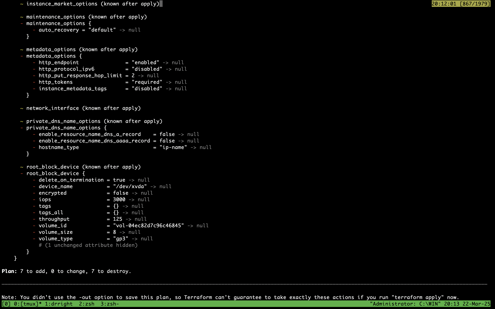

# AWS Infrastructure with Custom AMI and Terraform Provisioning

This repository contains the infrastructure-as-code for provisioning the necessary AWS resources with Terraform and installing and enabling docker on all of them using Ansible.

## Overview

This project automates the following:

1. **AWS Infrastructure Provisioning using Terraform**  
   The Terraform scripts in this repo provision the following resources:
   - A new VPC with both public and private subnets
   - All necessary routing (Internet gateway, NAT gateway, route tables)
   - One bastion host in the public subnet that only accepts SSH connections (port 22) from your IP address
   - Six EC2 instances in the private subnet, 3 running Ubuntu and 3 running Amazon Linux.


2. **Configuration Management using Ansible**  
   After provisioning the infrastructure, Ansible is used to configure the EC2 instances:  
   - Install the latest version of Docker on all 6 instances.  
   - Ensure Docker service is enabled and running.  
   - Verify the installation by checking the Docker version.
   - Displays the disk usage


## Repository Structure

```
.
├── terraform/
│   ├── main.tf              # Main Terraform configuration
│   ├── variables.tf         # Terraform variables definition
│   ├── outputs.tf           # Terraform outputs
|   └── versions.tf          # Terraform Version
├── scripts/
|   ├── install_ansible.sh   # Terraform Destroy
|   ├── run_ansible.sh       # Install script 
├── run_now.sh               # Entrypoint
├── .env                     # env file
└── README.md                # This file
```

## Prerequisites

- [Terraform](https://www.terraform.io/) installed on your local machine
- AWS Academy labsuser.pem key file
- AWS CLI credentials ready

## How to Run the Project

### 1. Download labsuser.pem file
1. Go to AWS Academy Console
2. Click on start lab
3. Then click on AWS Details on the top right
4. Then click on download PEM in the SSH key section


### 2. Create .env file in root

```sh
export AWS_ACCESS_KEY=""
export AWS_SECRET_KEY=""
export AWS_SESSION_TOKEN=""
export AWS_REGION="us-east-1"
export SSH_KEY_PATH="/Users/sahil/Downloads/labsuser.pem"
```
(add values for aws credentials in this file)

### 2. Run the script
```sh
chmod +x run_now.sh
./run_now.sh
```

### 3. Verify the Deployment:
The run now script by default will run the tests to verify the deployment. You can also run it manually
```sh
chmod +x scripts/*
./scripts/test.sh
```

#### 4. (Optional Destroy script)
Run this script to destroy every reasource created
```sh
./scripts/destroy.sh
```
(make sure to run it from the project's root directory or you will face path issues.)

## Expected Outputs

- **Terraform:** A new VPC with public and private subnets, one bastion host (accessible via your IP on port 22), and 6 EC2 instances in the private subnet launched with the custom AMI.
   - vpc id
   - bastion public ip
   - 6 private instances ip
      - 3 running Ubuntu
      - 3 running Amazon Linux

- **Ansible:** Latest version of docker installed and running in all 6 ec2 instances.

## Screenshots

- Terraform Init


- Terraform Plan


- Terraform Apply


- **Ansible Graph**  


- Dokcer Version


- Disk Usage


- Summary


## Conclusion

This project demonstrates the use of Terraform and Ansible to provision a complete AWS environment, including a VPC, subnets, a bastion host, and EC2 instances (3 Ubuntu and 3 Amazon Linux). All resources are configured with precise network settings, security rules, and Docker installed with the latest version using Ansible.

The comprehensive README and included screenshots ensure that every step—from infrastructure creation to the final Ansible run—can be replicated and understood.

---

